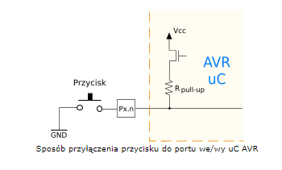

# Temat dodatkowy!!!
**Nie musicie tego robić w projektach.** To jest ponad program.
# One interrupt to rule them all

Jak zrobić jedno przerwanie które jest wyzwalane dla wielu guzików?

### Powtórzenie:
Przerwania to funkcje które wykonują się gdy dzieje się coś ze świata wewnętrzego co trzeba obsłużyć natychmiast. Wtedy mikrokontroler przerywa wykonywanie głównego programu żeby wykonać funkcję która została zdefiniowana jako ISR - *interrupt service routine* - czyli funkcja obsługująca przerwanie.

robimy to używając polecenia:
```c++
attachInterrupt(digitalPinToInterrupt(2), funkcjaObsługiPrzerwania, FALLING);
```

Podajemy tam 3 argumenty:
1. `digitalPinToInterrupt(2)` instrukcję która oznacza na którym wejściu kontroler ma czekać na przerwanie. (w tym wypadku pin 2)
2. `funkcjaObsługiPrzerwania` to zwykła funkcja którą definiujemy gdzieś w kodzie programu która zostanie wykonana podczas obsługi przerwania
3. `FALLING|RISING|CHANGE` stała która mówi kiedy kontroler ma zareagować
   1. `FALLING` - reagujemy gdy napięcie zmienia się z wysokiego (5v) na niskie (0v)
   2. `RISING` - reagujemy gdy napięcie rośnie z niskiego (0v) na wysokie (5v)
   3. `CHANGE` - reagujemy gdy napięcie się zmienia w którą kolwiek stronę

### Pull-up
Używamy czegoś co się nazywa pull-up czyli ustawiamy nasz pin takim poleceniem:
```c++
pinMode(2, INPUT_PULLUP);
```
To oznacza że domyślnie na tym pinie będzie wysokie napięcie(5v), chyba że podłączymy go do uziemienia (0v).



Tak jak widać na rysunku, jeśli nie wciśniemy guzika, pin oznaczony `Px.n` będzie miał wartość `1` (5v), jeśli go wciśniemy, podłączymy pin do uziemienia i wartość zmieni się na `0` (0v). 

### podłączenie wielu guzików do jednego przerwania:

Chcemy wyzwolić przerwanie gdy którykolwiek z guzików jest wciśnięty. W takim razie wszystkie guziki podłączymy do tego samego wejścia arduino nr 2.

Teraz chcielibyśmy jeszcze żeby mikro-kontroler był w stanie przeczytać wartość odpowiadającą temu który guzik jest wciśnięty, więc dodatkowo podłączymy każdy guzik oddzielnie do jednego pinu arduino:


Ale czy to wystarczy? Sprawdźmy co się stanie jeśli naciśniemy guzik `G1`. Co będzie podłączone do uziemienia?
Na tym rysunku zaznaczyłem to co jest podłączone do uziemienia na czerwono:


Wszędzie gdzie możemy dojść po kabelkach od GND będzie napięcie 0v. 


Ale **uwaga!** Idąc po zielonym  a potem fioletowym kabelku możemy dojść dalej!


I jeszcze dalej!


Dlatego jesli teraz sprawdzimy stan pinów `2`, `8`, `9` i `10` wszędzie będzie stan `0`! a wcisneliśmy tylko guzik `G1`!!!

### Dioda
Żeby rozwązać ten problem, musimy użyć diody. Diodę oznaczamy tak:


Żeby móc prowadzić dalej nasze rozważania zobaczmy jak będzie propagowało się niskie napięcie przez diodę? Przez diodę możemy przejść rysując czerwone kropki tylko od strony pionowej kreski:


Spadek napięcia na diodzie możemy uznać za pomijalny, a przez rezystor nie możemy dalej przejść. Tak więc, wszędzie gdzie są czerwone kropki zmierzylibyśmy napięcie `0v`! 

Co jeśli podłączymy diodę odwrotnie?


Nie wolno nam przejść przez diodę od drugiej strony. Napięcie będzie się propagowało w ten sposób:

I tyle.


### Przerwania dla kilku guzików:
Skoro wiemy że dioda zatrzyma rozlewanie się czerwonych kropek to teraz musimy zastosować to w praktyce. Jeśli podłączymy przerwanie przez odpowiednio ustawione diody, po wciśnięciu guzika zewrzemy do uziemienia tylko odpowiedni pin i pin przerwania:


W ten sposób, po wciśnięciu guzika `G1` napięcie zmieni się na niskie tylko na pinie 2 i 8. 
Jeśli teraz chcemy żeby nasza funkcja obsługująca przerwanie sprawdzała który guzik jest wciśnięty, robimy to sprawdzając co jest wciśnięte wewnątrz tej funkcji.

```c++
void handleInterrupt(){
  if(digitalRead(8) == LOW){
    //guzik G1 jest wciśnięty
  }
  if(digitalRead(9) == LOW){
    //guzik G2 jest wciśnięty
  }
  if(digitalRead(10) == LOW){
    //guzik G3 jest wciśnięty
  }
}
```


