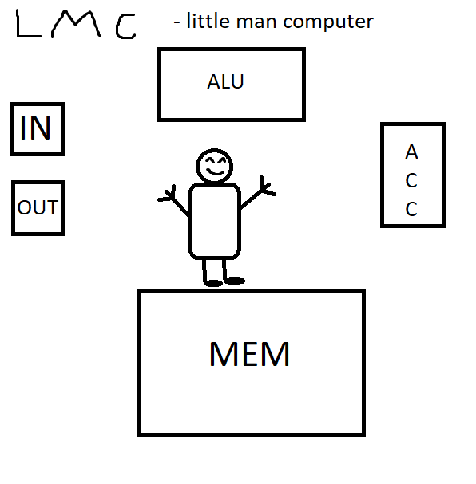

# Jak działa procesor

[LMC](https://www.101computing.net/lmc-simulator/)

Little Man Computer - LMC to uproszczony model procesora który ma tylko najbardziej niezbędne operacje.



Traktujemy działanie CPU tak jakby w środku siedział mały ludzik, który ma kilka koszyczków:

- IN/OUT
- ACC - Acumulator
- MEM - Pamięć
- ALU - Algorithmic Logic Unit

Ten ludzik, wykonuje instrukcje jedna po drugiej.
Te instrukcje brzmią następująco:

| Mnemonic |        Name        |                                             Description                                            |
|:--------:|:------------------:|:--------------------------------------------------------------------------------------------------:|
|    INP   |        INPUT       |                       Weź wartość z wejścia (`IN`) i przenieś do akumulatora.                      |
|    OUT   |       OUTPUT       |                         Przenieś wartość z akumulatora do wyjścia (`OUT`).                         |
|    LDA   |        LOAD        |                              załaduj wartość z pamięci do akumulatora.                             |
|    STA   |        STORE       |                               Zapisz wartość z akumulatora w pamięci.                              |
|    ADD   |         ADD        |  Dodaj wartość z pamięci do tej która jest aktualnie w akumulatorze, wynik zapisz do akumulatora.  |
|    SUB   |      SUBTRACT      | Odejmij wartość z pamięci od tej która jest aktualnie w akumulatorze, wynik zapisz do akumulatora. |
|    BRP   | BRANCH IF POSITIVE |       Skocz do innej linijki programu jeśli wartość w akumulatorze jest większa lub równa 0.       |
|    BRZ   |   BRANCH IF ZERO   |             Skocz do innej linijki programu jeśli wartość w akumulatorze jest równa 0.             |
|    BRA   |    BRANCH ALWAYS   |                                  skocz do innej linijki programu.                                  |
|    HLT   |        HALT        |                                          Zatrzymaj program                                         |
|    DAT   |    DATA LOCATION   |  Służy do nazywania adresów w pamięci. Można też dodać wartość która powinna być tam przechowana.  |


W ten sposób, jeśli mamy dwie liczby w pamięci i chcemy je dodać i wypisać wynik, najpierw ładujemy jedną z nich do akumulatora.
```
        LDA num1
```
Następnie dodajemy drugą liczbę:
```
        ADD num2
```
Po wykonaniu tej operacji wynik znajduje się w akumulatorze. Trzeba go jeszcze wypisać.
```
OUT
```

Program dodający dwie liczby w pamięci:
```
        LDA num1
        ADD num2
        OUT
        HLT
		
num1    DAT 1
num2    DAT 50 
```


Program sprawdzający nierówność trójkąta:
```
        INP
        STA num1
        INP
        STA num2
        INP
        STA num3
check1	LDA num1
        ADD num2
        SUB num3
        BRP check2
fail    LDA zero
        OUT
        HLT
check2  LDA num2
        ADD num3
        SUB num1
        BRP check3
	BRA fail
check3  LDA num1
        ADD num3
        SUB num2
        BRP succ
        BRA fail
succ    LDA one
        OUT
        HLT
		
num1    DAT
num2    DAT
num3    DAT
zero    DAT 0
one     DAT 1
```