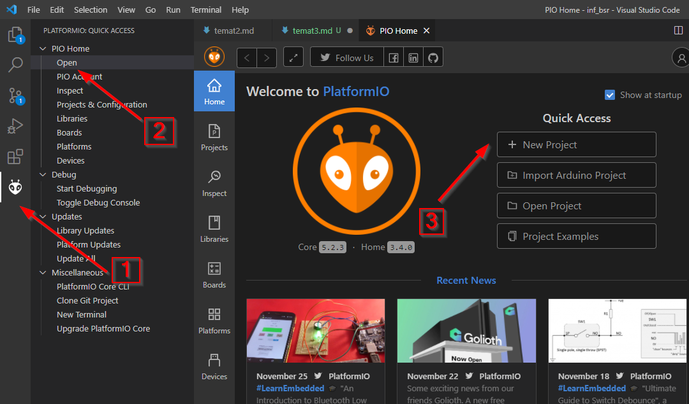
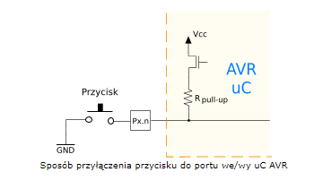

# Arduino

Zaczynamy zabawę. Każdy z Was dostał płytkę arduino UNO.

Na płytce znajduje się mikro-procesor formy ATmel - ATmega328P.

## Hardware:

Używamy płytki arduino ponieważ w ogromny sposób ułatwia nam pracę z mikrokontrolerem. Nie musimy się martwić o podłączanie zasilania, o kwarc i o programowanie mikrokontrolera. Arduino robi wszystko za nas, dostarcza też nam prosty interfejs komunikacji z mikro-kontrolerem przez USART, co bardzo ułatwia pracę. Ale o tym później. 

Ta płytka ma następujący pin-out:
~[arduinoUNO - pinout](https://images.prismic.io/circuito/8e3a980f0f964cc539b4cbbba2654bb660db6f52_arduino-uno-pinout-diagram.png?auto=format)

## Instalacja 
Będziemy używać VScode z dodatkiem PlatformIO IDE. Na ostatniej lekcji instalowaliśmy je na komputerach w sali, ale dla przypomnienia:

-  [Download VSCode](https://code.visualstudio.com/download)
-  [Install PlatformIO](https://platformio.org/install/ide?install=vscode)

Po wykonaniu tych kroków po odpaleniu VSCode w lewym dolnym rogu powinna pojawić się ikonka PlatformIO 


## Kod na arduino
Po Instalacji, tworzymy nowy projekt.

Wybieramy płytkę arduinoUNO i klikamy ok. Czekamy aż program przygotuje dla nas środowisko.

Kiedy to się stanie, otwieramy plik `src/main.cpp`.

## Blink

```c++
#include <Arduino.h>

void setup()
{
  // put your setup code here, to run once:
  pinMode(13, OUTPUT);
}

void loop()
{
  // put your main code here, to run repeatedly:
  digitalWrite(13, HIGH);
  delay(1000);            // waits for a second
  digitalWrite(13, LOW);
  delay(1000);            // waits for a second
}
```

Co tu się właściwie dzieje?

Z każdym z równoległych portów we/wy: A,B,C,D powiązane są po trzy rejestry I/O, o nazwach: DDRx, PORTx, PINx, gdzie x to litery A,B,C,D.

-  `DDRx` - Data Direction Register decyduje czy dany port to wejście czy wyjście.
-  `PORTx` 
    - Jeśli dany pin pracuje jako **wyjście**, ustawiając odpowiedni bit rejestru `PORTx` jesteśmy w stanie wymusić stan wysoki na tym pinie
    - Jeśli dany pin pracuje jako **wejście**, ustawiając odpowiedni bit rejestru `PORTx` możemy 'podciągnąć' dany pin do zasilania - tzw. 'pull-up'
- `PINx` - wartość tego portu zawsze odpowiada stanowi na wyjściu 1 - jeśli stan wysoki, 0 jeśli stan niski.

### PULL-UP



Instrukcja `pinMode()` pozwala na ustawienie odpowiedniej wartośći w odpowiednim rejestrze `DDRx` (A,B,C lub D).

Instrukcja `digitalWrite()` ustawia odpowiednią wartość w rejestrze `PORTx`.

Wiesz już co robi instrukcja `digitalRead()`?

## Serial print

Rozszerzymy nasz program o dwie instrukcje. Po pierwsze zdefiniujemy sobie zmienną globalną counter. 

Po drugie, w funkcji `setup()` dodamy `Serial.begin(9600)`. Ta instrukcja pozwala nam na komunikację z komputerem. Na razie nie zastanawiamy się w jaki sposób to działa.

Na koniec, dodamy jeszcze linijkę w `loop()` - `Serial.println("loop " + ((String)counter))`. Ta linijka wysyła przez serial port do komputera wartość zmiennej counter.

```c++
#include <Arduino.h>

uint8_t counter = 0;

void setup()
{
  // put your setup code here, to run once:
  pinMode(13, OUTPUT);
  Serial.begin(9600);
}

void loop()
{
  counter += 1;
  Serial.println("loop " + ((String)counter));
  // put your main code here, to run repeatedly:
  digitalWrite(13, HIGH);
  delay(1000);            // waits for a second
  digitalWrite(13, LOW);
  delay(1000);            // waits for a second
}
```

- Czy counter może rosnąć w nieskończoność?
- Zmień wartość opóźnienia i sprawdź co się stanie gdy counter przekroczy wartość 255?

## wyświetlanie cyfr

Datasheet:


## używając kodu Arduino

```c++
#include <Arduino.h>

#define PinA 1
#define PinB 2
#define PinC 3
#define PinD 4
#define PinE 5
#define PinF 6
#define PinG 7

void display(uint8_t x){
    if(x == 0){
        //display 0
        return;
    }
    if(x == 1){
        //display 1
        return;
    }
    if(x == 2){
        //display 2
        return;
    }
    if(x == 3){
        //display 3
        return;
    }
    if(x == 4){
        //display 4
        return;
    }
    if(x == 5){
        //display 5
        return;
    }
    if(x == 6){
        //display 6
        return;
    }
    if(x == 7){
        //display 7
        return;
    }
    if(x == 8){
        //display 8
        return;
    }
    if(x == 9){
        //display 9
        return;
    }
    // display nothing
    digitalWrite(PinA, HIGH);
    digitalWrite(PinB, HIGH);
    digitalWrite(PinC, HIGH);
    digitalWrite(PinD, HIGH);
    digitalWrite(PinE, HIGH);
    digitalWrite(PinF, HIGH);
    digitalWrite(PinG, HIGH);
    return;
}


uint8_t counter;

void setup()
{
  // put your setup code here, to run once:
  pinMode(PinA, OUTPUT);
  pinMode(PinB, OUTPUT);
  pinMode(PinC, OUTPUT);
  pinMode(PinD, OUTPUT);
  pinMode(PinE, OUTPUT);
  pinMode(PinF, OUTPUT);
  pinMode(PinG, OUTPUT);
  
  display(10);
  counter = 0;
}

void loop()
{
  // put your main code here, to run repeatedly:
  delay(1000);            // waits for a second
  counter = (counter + 1) % 11;
  display(counter);
}

```


## używając rejestrów

```c++
#include <Arduino.h>

#define ONE   0b11100111
#define TWO   0b01001001
#define THREE 0b01000011
#define FOUR  0b00100111
#define FIVE  0b00010011
#define SIX   0b00010001
#define SEVEN 0b11000111
#define EIGHT 0b00000001
#define NINE  0b00000011
#define ZERO  0b10000001

void display(int x){
  PORTD &= 0b00000001;
  if(x == 0){ 
    PORTD |= ZERO;
    return;
  }
  if(x == 1){ 
    PORTD |= ONE;
    return;
  }
  if(x == 2){
    PORTD |= TWO;
    return;
  }
  if(x == 3){ 
    PORTD |= THREE;
    return;
  }
  if(x == 4){ 
    PORTD |= FOUR;
    return;
  }
  if(x == 5){ 
    PORTD |= FIVE;
    return;
  }
  if(x == 6){ 
    PORTD |= SIX;
    return;
  }
  if(x == 7){ 
    PORTD |= SEVEN;
    return;
  }
  if(x == 8){ 
    PORTD |= EIGHT;
    return;
  }
  if(x == 9){ 
    PORTD |= NINE;
    return;
  }
  PORTD |= 0b11111110;
}

uint8_t counter;

void setup()
{
  // set port D as output
  DDRD = 0b11111110;
  counter = 0;
}

void loop()
{
  // put your main code here, to run repeatedly:
  counter = (counter + 1)%11;
  display(counter);
  delay(200);
}
```


<!-- Rozwiązanie:
```c++
#include <Arduino.h>

#define PinA 7
#define PinB 6
#define PinC 5
#define PinD 4
#define PinE 3
#define PinF 8
#define PinG 10

void display(uint8_t x)
{
  if (x == 0)
  {
    //display 0
    digitalWrite(PinA, LOW);
    digitalWrite(PinB, LOW);
    digitalWrite(PinC, LOW);
    digitalWrite(PinD, LOW);
    digitalWrite(PinE, LOW);
    digitalWrite(PinF, LOW);
    digitalWrite(PinG, HIGH);
    return;
  }
  if (x == 1)
  {
    //display 1
    digitalWrite(PinA, HIGH);
    digitalWrite(PinB, LOW);
    digitalWrite(PinC, LOW);
    digitalWrite(PinD, HIGH);
    digitalWrite(PinE, HIGH);
    digitalWrite(PinF, HIGH);
    digitalWrite(PinG, HIGH);
    return;
  }
  if (x == 2)
  {
    //display 2
    digitalWrite(PinA, LOW);
    digitalWrite(PinB, LOW);
    digitalWrite(PinC, HIGH);
    digitalWrite(PinD, LOW);
    digitalWrite(PinE, LOW);
    digitalWrite(PinF, HIGH);
    digitalWrite(PinG, LOW);
    return;
  }
  if (x == 3)
  {
    //display 3
    digitalWrite(PinA, LOW);
    digitalWrite(PinB, LOW);
    digitalWrite(PinC, LOW);
    digitalWrite(PinD, LOW);
    digitalWrite(PinE, HIGH);
    digitalWrite(PinF, HIGH);
    digitalWrite(PinG, LOW);
    return;
  }
  if (x == 4)
  {
    //display 4
    digitalWrite(PinA, HIGH);
    digitalWrite(PinB, LOW);
    digitalWrite(PinC, LOW);
    digitalWrite(PinD, HIGH);
    digitalWrite(PinE, HIGH);
    digitalWrite(PinF, LOW);
    digitalWrite(PinG, LOW);
    return;
  }
  if (x == 5)
  {
    //display 5
    digitalWrite(PinA, LOW);
    digitalWrite(PinB, HIGH);
    digitalWrite(PinC, LOW);
    digitalWrite(PinD, LOW);
    digitalWrite(PinE, HIGH);
    digitalWrite(PinF, LOW);
    digitalWrite(PinG, LOW);
    return;
  }
  if (x == 6)
  {
    //display 6
    digitalWrite(PinA, LOW);
    digitalWrite(PinB, HIGH);
    digitalWrite(PinC, LOW);
    digitalWrite(PinD, LOW);
    digitalWrite(PinE, LOW);
    digitalWrite(PinF, LOW);
    digitalWrite(PinG, LOW);
    return;
  }
  if (x == 7)
  {
    //display 7
    digitalWrite(PinA, LOW);
    digitalWrite(PinB, LOW);
    digitalWrite(PinC, LOW);
    digitalWrite(PinD, HIGH);
    digitalWrite(PinE, HIGH);
    digitalWrite(PinF, HIGH);
    digitalWrite(PinG, HIGH);
    return;
  }
  if (x == 8)
  {
    //display 8
    digitalWrite(PinA, LOW);
    digitalWrite(PinB, LOW);
    digitalWrite(PinC, LOW);
    digitalWrite(PinD, LOW);
    digitalWrite(PinE, LOW);
    digitalWrite(PinF, LOW);
    digitalWrite(PinG, LOW);
    return;
  }
  if (x == 9)
  {
    //display 9
    digitalWrite(PinA, LOW);
    digitalWrite(PinB, LOW);
    digitalWrite(PinC, LOW);
    digitalWrite(PinD, LOW);
    digitalWrite(PinE, HIGH);
    digitalWrite(PinF, LOW);
    digitalWrite(PinG, LOW);
    return;
  }
  // display nothing
  digitalWrite(PinA, HIGH);
  digitalWrite(PinB, HIGH);
  digitalWrite(PinC, HIGH);
  digitalWrite(PinD, HIGH);
  digitalWrite(PinE, HIGH);
  digitalWrite(PinF, HIGH);
  digitalWrite(PinG, HIGH);
  return;
}

uint8_t counter;

void setup()
{
  // put your setup code here, to run once:
  pinMode(PinA, OUTPUT);
  pinMode(PinB, OUTPUT);
  pinMode(PinC, OUTPUT);
  pinMode(PinD, OUTPUT);
  pinMode(PinE, OUTPUT);
  pinMode(PinF, OUTPUT);
  pinMode(PinG, OUTPUT);

  display(10);
  counter = 0;
}

void loop()
{
  // put your main code here, to run repeatedly:
  counter = (counter + 1) % 11;
  display(counter);
  delay(200);
}
``` -->
